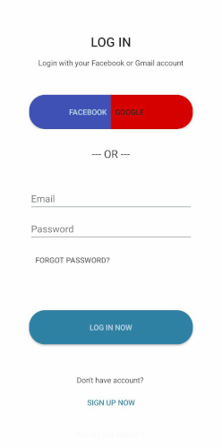

# Ethiopian Students Exam Practice App

This app is designed to help Ethiopian students prepare for their exams by providing a platform to practice questions and track their progress.

## Features

- **Question Bank**: Access a wide variety of exam questions across different subjects.
- **Practice Mode**: Practice questions in a timed or untimed mode.
- **Progress Tracking**: Track your performance and see your improvement over time.
- **User-friendly Interface**: Simple and intuitive interface designed for ease of use.
- **Offline Access**: Use the app without an internet connection once downloaded.

## Installation

To install the Ethiopian Students Exam Practice App on your Android device, follow these steps:

1. **Download the APK**: [https://github.com/mekete/QuestionBank/blob/main/media/app_demo.apk]
2. **Enable Unknown Sources**: Go to Settings > Security > Enable "Unknown sources".
3. **Install the App**: Open the downloaded APK file and follow the on-screen instructions to install the app.

## Usage

1. **Open the App**: Tap the app icon to open it.
2. **Select a Subject**: Choose the subject you want to practice.
3. **Start Practicing**: Begin practicing questions. You can choose between timed and untimed modes.
4. **Track Your Progress**: Check your performance statistics to see your improvement over time.

## Media

### Screenshots

_Login screen_

_Main Menu of the app_

_Question screen showing a sample question_

### Video

Check out our demo video to see the app in action:

_App Demo Video_
